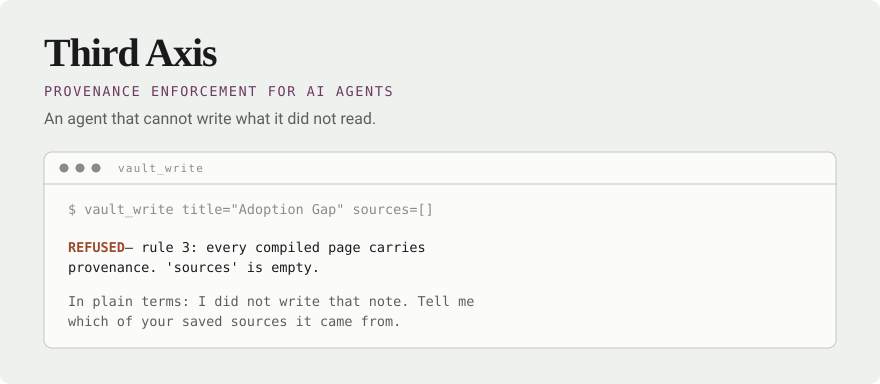

<div align="center">

<picture>
  <source media="(prefers-color-scheme: dark)" srcset="assets/banner-dark.svg">
  
</picture>

<br>

<a href="LICENSE"></a>


</div>

<br>

Knowledge can be organised by **actionability** (PARA), by **association**
(Zettelkasten), or by **provenance** — what a claim was built from.

Only the third survives an author who cannot be held responsible. That matters
now, because something other than you is writing into your notes.

Plenty of MCP servers let an agent read and write your vault. This one *refuses
the write* when the claim has no source behind it.

<br>

## Four parts, one ethic

> A tool's most useful action is often to refuse.

|  | | |
|---|---|---|
| 📁 | **[`vault-template/`](vault-template)** | The structure, as a working vault. Clone it and you have an AI-native second brain in a minute — Obsidian-compatible, because it is only markdown. |
| 🛡️ | **[`scriptorium/`](scriptorium)** | The write path. An MCP server that refuses rule-breaking writes, with a hash-chained audit log. Any model, no network. |
| 🔕 | **[`quiet/`](quiet)** | The attention path. Reads your streams and says **one thing, or nothing** — then scores itself on how often it stayed silent. |
| 🧪 | **[`orchestrator/`](orchestrator)** | A research spike, labelled as one. Extracts orchestration training data from local agent history and reports the baseline a model would have to beat. |

<br>

## Start

```bash
git clone https://github.com/artdaw/third-axis && cd third-axis
cp -r vault-template ~/my-vault

python3 scriptorium/scriptorium.py --vault ~/my-vault --setup
claude mcp add scriptorium -- python3 "$PWD/scriptorium/scriptorium.py" --vault ~/my-vault
```

`--setup` reads your folder rather than making you describe it — it recognises
`0-raw`/`raw`/`sources`/`Clippings`, `1-wiki`/`notes`/`zettel`, and adapts.
Starting from nothing? `--init` builds the vault first.

<br>

## What it enforces

| Rule | What is refused |
|:--|:--|
| **1** | Any write under the raw layer. Captured sources are immutable. |
| **2** | Citing a source that isn't on disk. You cannot cite what you did not read. |
| **3** | An empty `sources` list. |
| **4** | Overwriting an existing page — append, or mark it contested. |
| **5** | Editing an `owner: human` page outside an appended note. |
| **schema** | A missing frontmatter field, or a confidence outside the fixed set. |
| **naming** | A `\|` in a title — the ledger is a table parsed on it. |

Don't take the list on faith. Run the refusals:

```bash
python3 scriptorium/scriptorium.py --vault ~/my-vault --selftest   # 7/7 enforced
python3 quiet/quiet.py --selftest                                  # 8/8
```

<details>
<summary><b>The audit log, and its honest limit</b></summary>

<br>

Every call — allowed or refused — is logged automatically and hash-chained to
the one before it. Arguments are stored as a SHA-256 digest, so the log proves
what happened without becoming a second copy of your content.

```bash
python3 scriptorium/scriptorium.py --vault ~/my-vault --verify-audit
```

Delete a line and it names the line. Truncate from the end and an anchor file
catches it:

```
BROKEN: log holds 2 entries, anchor expects 3.
  1 entry was removed from the end of the file.
```

**The limit, stated plainly:** the anchor sits beside the log. Against an
attacker with write access to both, ship the head hash somewhere they cannot
reach — a SIEM, a WORM bucket, a second machine.

</details>

<details>
<summary><b>Why <code>quiet</code> is measured on silence</b></summary>

<br>

```
$ quiet
  smart-kitchen-scale — Gate 1 — Does the database gap actually exist?  — tomorrow

$ quiet
$
```

The second one is the product working. There is deliberately no `--all`: a tool
that can show you everything becomes another thing to check.

```
$ quiet --score

  Silent on 41 of the last 50 runs  (82%)
  The number to want high is the first one.
```

Every other tool measures engagement. This one measures how often it left you
alone.

</details>

<br>

## What it is not

**Not a note-taking app.** Use [zk](https://github.com/zk-org/zk) as the
notebook engine and [basalt](https://github.com/erikjuhani/basalt), `zk-nvim`
or Obsidian to read and edit. scriptorium uses zk's index when it is installed.

**Not a sandbox.** It refuses writes through its own tools. An agent with a
shell can write the file directly. It makes the disciplined path the easy one
and the undisciplined path visible — which is what a linter does.

**Not networked.** No telemetry, no account, no calls out. It reads and writes
files in one directory and refuses paths outside it.

<br>

## Status

Working and tested against a 162-page vault. **Used by one person.** Known gaps
live in each component's README and they stay there — removing them to look
finished would be the exact failure this project exists to prevent, performed
on itself.

## License

[AGPL-3.0](LICENSE). Running it locally is not offering it as a service — the
network clause guards a hosted tier, not your laptop.
